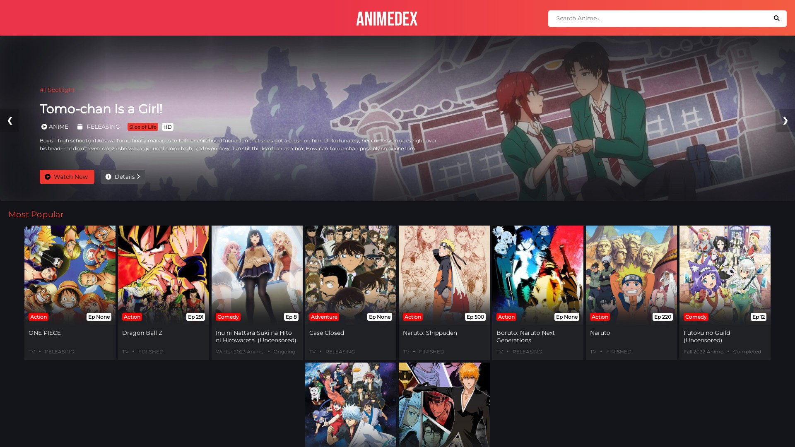
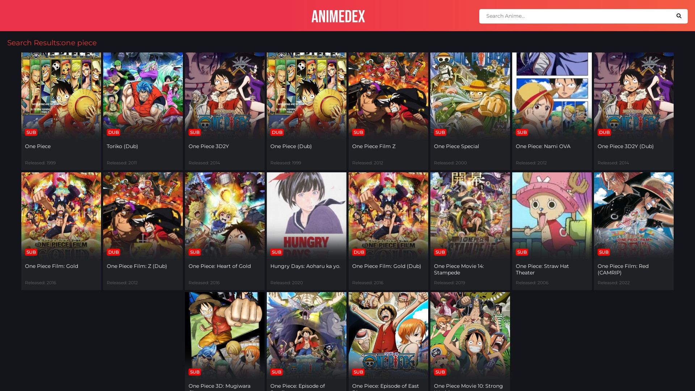
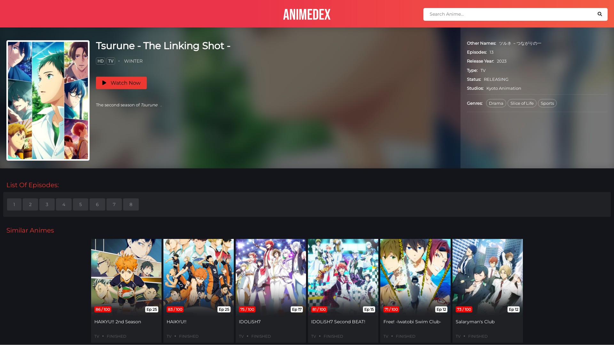
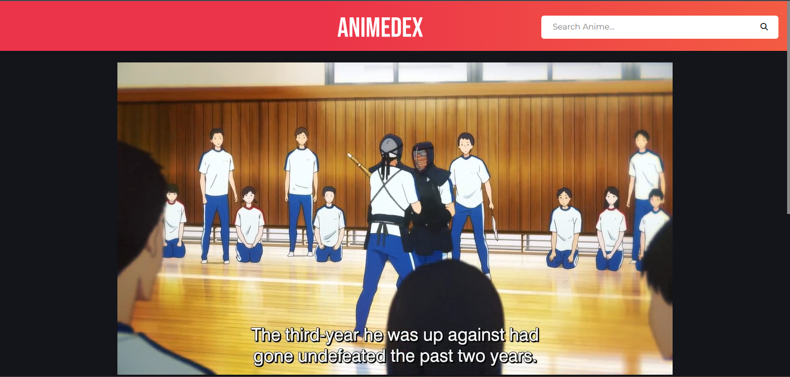

# AniDex-Anime-WebScraper


<hr>


<hr>

- Built With Flask In Python
- Fast And Responsive
- Uses Anilist To Get Data
- And GoGo Anime For Episodes

- Can Be Deployed To Vercel.com And Repl.it OR Any Other Hosting Service
> Website : https://animedex.live


<hr>

### ♻️ Get TechZApi


- Fill this in env or in config.py


<hr>

### ⚡️ Deploy Your Own

- Click Below To Deploy On Vercel

  [](https://vercel.com/new/clone?repository-url=https%3A%2F%2Fgithub.com%2FTechShreyash%2FAnimeDex&env=API_KEY&envDescription=Your%20TechZ%20Api%20Key%2C%20Get%20from%20%40TechZApiBot%20on%20Telegram%20&envLink=https%3A%2F%2Ft.me%2FTechZApiBot&project-name=animedex&repository-name=AnimeDex&demo-title=AnimeDex&demo-description=Watch%20Animes%20Online%20For%20Free&demo-url=animedex.live&demo-image=https%3A%2F%2Fgithub.com%2FTechShreyash%2FAnimeDex%2Fraw%2Fmain%2Fscreenshots%2Fhome.jpeg)

    - Demo : https://animedex.live

- Deploy To Repl.it

    


- Deploy To Heroku
  


- Deploy On Server
  - Install Requirements
    
    ```pip3 install -r requirements.txt```
  \
  - Start The Website

    ```python3 main.py```
  - Demo : https://animedex.live

  - Need Guide : 
    - https://docs.digitalocean.com/tutorials/app-deploy-flask-app/
    - https://flask.palletsprojects.com/en/2.0.x/deploying/

<hr>

### 📸 Screenshots

<br>









<hr>


